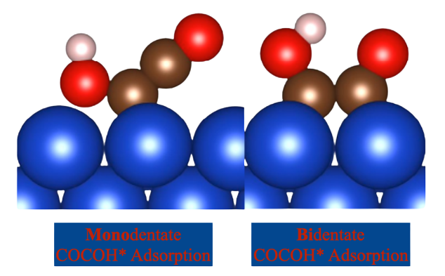
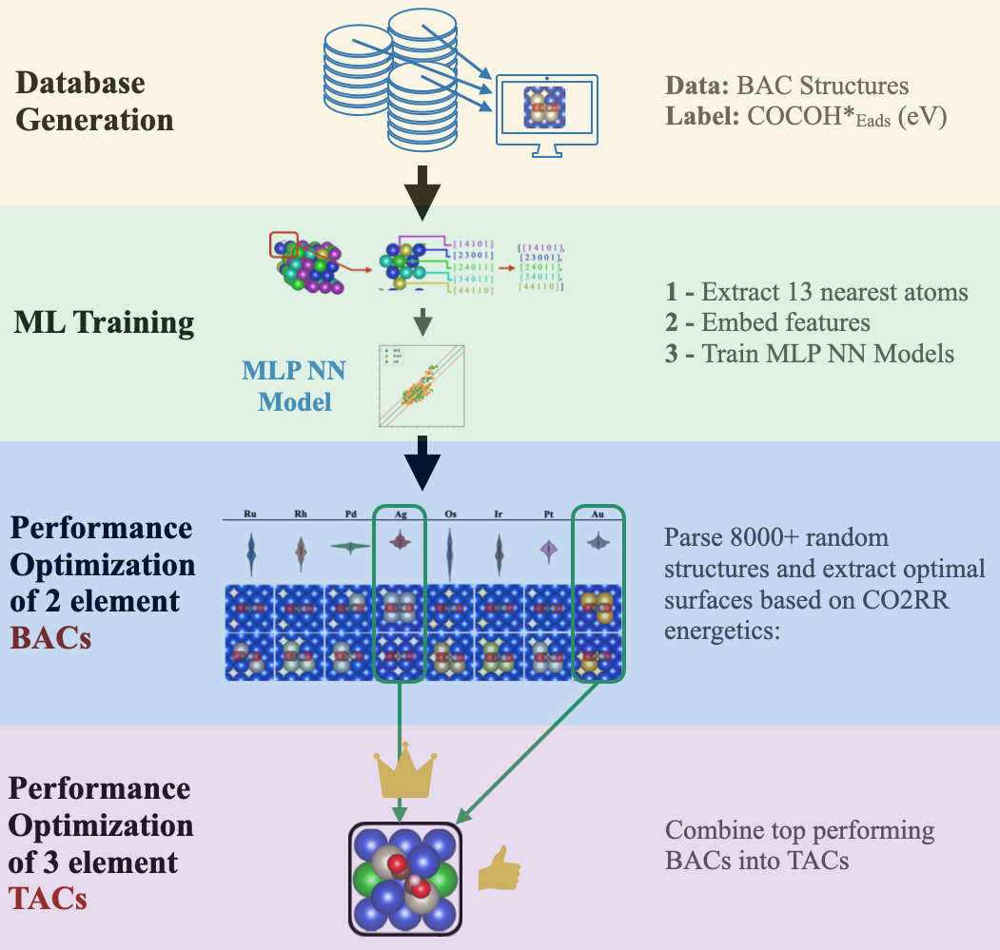

Machine Learning Powered Bottom-up Alloy Catalyst Discovery
============================================================

This repository provides the framework used to optimize and discover n+1 element catalysts from simpler n element catalyst. The code is scalable and can extrapolate to a wide range of oxide free catalysts. The full work is published in Energy Advances (RCS) - "Machine learning assisted binary alloy catalyst design for the electroreduction of CO2 to C2 products" (DOI: 10.1039/d2ya00316c).

Table of Contents
=================

<!--ts-->
   * [Scientific content](#scientific-content)
   * [Data science and ML content](#data-science-and-ML-content)
      * [Binary alloy catalyst database](#binary-alloy-catalyst-database)
      * [Feature space exploration](#feature-space-exploration)
      * [NN modeling](#NN-modeling)
      * [Active site optimization](#active-site-optimization)
   * [Usage](#usage)
   * [Code structure](#code-structure)
      * [File contents](#file-contents)
      * [Package dependencies](#package-dependencies)
<!--te-->

Scientific content
==================

In addition to the ML framework, this work performs the first ever investigation into the bidentate adsorption of COCOH*, a key intermediate in the CO2RR pathway towards its most valuable products (C2+). As seen below, literature exclusively focused on the monodentate pathway but this work shows the pathway energetics of bidentate dual CO co-adsorption followed by hydrogenation can be more favorable.

     

Data science and ML content
===========================
Binary alloy catalyst database
------------------------------
A new database on Binary Alloy Catalysts accompanies the code. This database contains 1600 unique structures of Cu alloyed with Ag, Au, Pt, Pd, Rh, Ru, Ir, Os. The dataset was generated using high-throughput computations on Compute Canada resources. Each computation utilized Quantum Espresso or VASP compilations to automate the majority of DFT calculations. For exact simulation parameters, functionals, and structures, please refer to my paper (DOI	https://doi.org/10.1039/D2YA00316C). 

Feature space exploration
-------------------------
The database extracted the nearest neighbors of the adsorbate and encoded individual atoms with chemical, quantum and spatial features. The exact encoding method can be found in one of my other repos (https://github.com/gariepyz/NN-Decomposition-For-Empirically-Derived-Insight/blob/main/helpers.py) under the 'feature_embedding' function. Due to the simplistic feature engineering performed, we were able to quantify the space exhaustiveness of each alloying composition. Additional notebook will be posted on our implementation of feature scores and intra/extrapolation degrees of prediction. 

NN modeling
-----------
A standard TensorFlow multilayer perceptron neural network was used to train on the dataset. Although these models are older, they worked well with the basic feature engineering we performed. For more up to date models, please see my Graph Neural Network (GNN) modeling publication/repo (https://github.com/gariepyz/Automatic-Graph-Representation-Algorithm)

Active site optimization
------------------------
An automated framework to extract,visualize, analyze and conver into DFT readable files for ML predicted optimal structures was created from scratch. This optimization was also employed for the bottom-up design of increasingly complex catalyst by using simpler builder blocks. 

Usage
=====
The main notebook titled 'Catalyst_Discovery_Framework' performs importing, prediction, visualization, configurational space exploration, optimization and generation. These steps are thoroughly commented and walked through in the notebook.

The exact pipeline used to discover catalysts is visualized below. my publication elaborates on the design decisions, science and discovery featured in this framework.

     

Code structure
==============
File contents
-------------
In this repo are the following files:

Catalyst_Discovery_Framework.ipynb: a notebook walking through the framework used to discover 3 element alloy catalysts from 2 element binary alloy catalysts (BAC). Models framework based on TensorFlow 2.0 MLP NN.

helpers.ipynb: helper function with the algorithms that power this framework

saved_NN_parameters folder: saved weight/bias so you dont have to train a model yourself (conveniance only)
saved_dataset.npy: train/test split for saved model

Cu_pure: sample structure for automated catalyst surface generation

All code is thoroughly commented but if you have any questions, please feel free to reach out to me!

Package dependencies
--------------------
- NumPy
- Pandas
- Matplotlib
- Seaborn
- TensorFlow/Keras
- Atomic Simulation Environment (ASE)
- Sklearn
