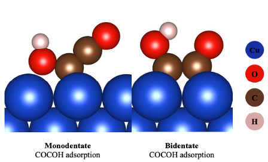

# Machine Learning Powered Bottom-up Alloy Catalyst Discovery
This repository provides the framework used to optimize and discover n+1 element catalysts from simpler n element catalyst. Code is scalable for larger element sizes as well. The full work is published under the title "Machine learning assisted binary alloy catalyst design for the electroreduction of CO2 to C2 products" (DOI: 10.1039/d2ya00316c).

In addition to the ML framework, this work provides the first ever investigation into the bidentate adsorption of COCOH, a key intermediate in the CO2RR pathway towards its most valuable products (C2+). As seen below, literature exclusively focused on the monodentate pathway but this work shows the energetics of bidentate dual CO co-adsorption followed by hydrogenation can provide a more energetically favorable pathway.

The main notebook titled 'Catalyst_Discovery_Framework' performs configurational space exploration, predicts optimal catalyst structures and automatically generates VASP readable geometry files based on the ML guided optimization.

The exact pipeline used to discover catalyst is visualized below. The notebook elaborates on the design decisions, science and discovery featured in the publication.

     

In this repo are the following files:

Catalyst_Discovery_Framework.ipynb: a notebook walking through the framework used to discover 3 element alloy catalysts from 2 element binary alloy catalysts (BAC). Models framework based on TensorFlow 2.0 MLP NN.

helpers.ipynb: helper function with the algorithms that power this framework

saved_NN_parameters folder: saved weight/bias so you dont have to train a model yourself (conveniance only)
saved_dataset.npy: train/test split for saved model

Cu_pure: sample structure for automated catalyst surface generation

All code, functions, class are thoroughly commented but if you have any questions, please feel free to reach out to me!
